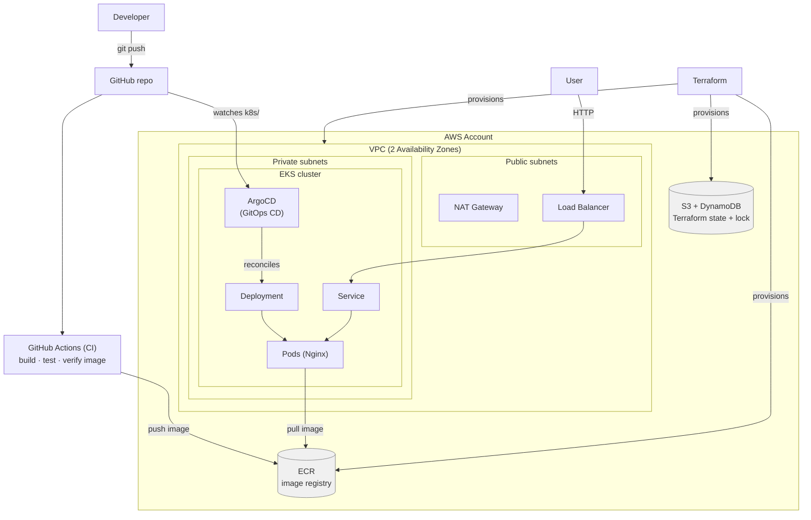
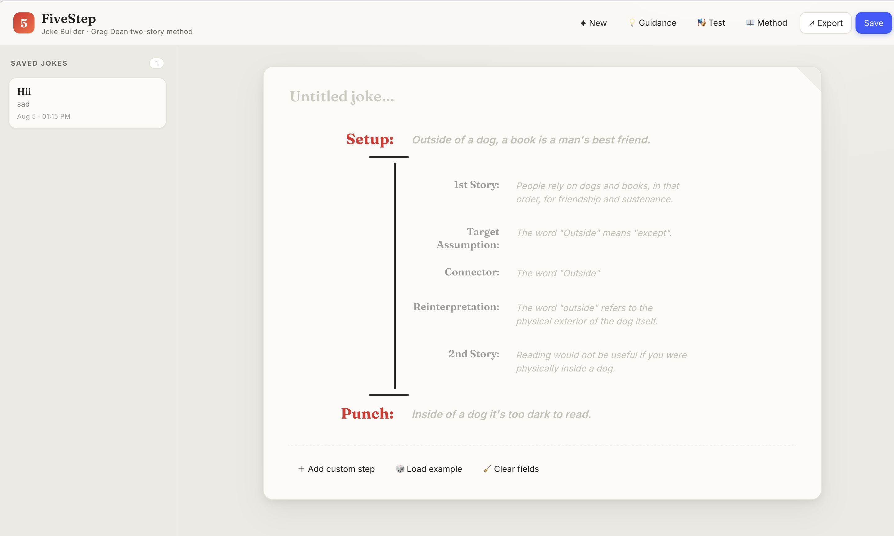
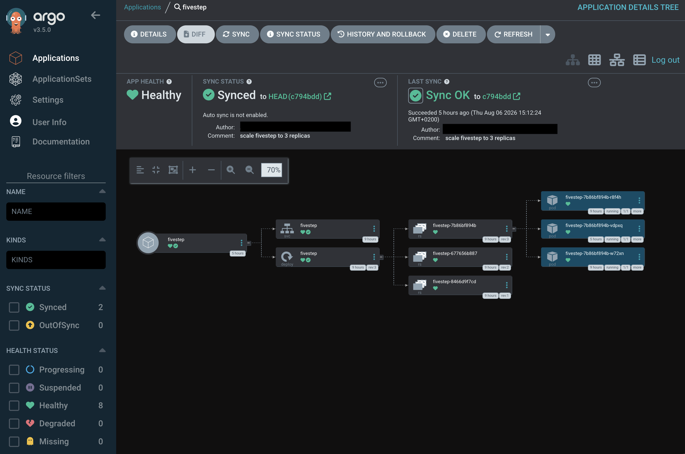
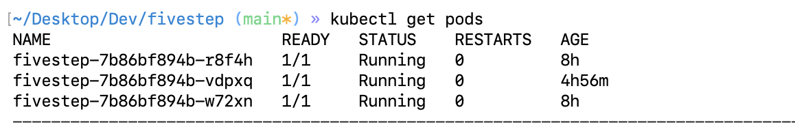
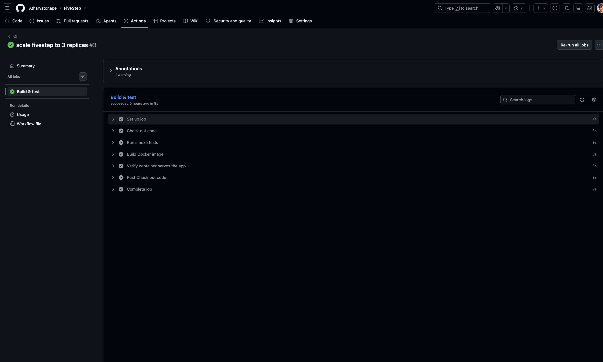

# FiveStep — a joke builder, deployed the production way

FiveStep is a small web app for writing jokes using comedian Greg Dean's
two-story method. But the app is really an excuse: this repo is an end-to-end
demonstration of a **modern cloud-native delivery pipeline** — containerized
with Docker, provisioned on **AWS EKS with Terraform**, delivered with
**GitHub Actions (CI)** and **ArgoCD (GitOps CD)**.

Anyone can clone this repo and stand the whole platform up in **their own AWS
account** with a single command.

## Architecture



> Provisioning (VPC, EKS, ECR, state backend) is done by **Terraform**.
> The app is delivered by **CI → ECR → GitOps (ArgoCD) → Kubernetes**.

---

## What this project demonstrates

| Layer | Tech | What it does |
|-------|------|--------------|
| **App** | Static HTML/CSS/JS | The FiveStep joke builder (state in browser localStorage) |
| **Container** | Docker + Nginx (unprivileged, Alpine) | Packages the app into a portable, non-root image |
| **Registry** | AWS ECR | Private store for the container image |
| **Infrastructure** | Terraform | VPC (public/private subnets, NAT), EKS cluster, ECR — all as code |
| **State** | S3 + DynamoDB | Remote Terraform state with locking |
| **Orchestration** | Kubernetes (EKS) | Runs the app: 2+ replicas, self-healing, load-balanced |
| **CI** | GitHub Actions | Builds, tests, and verifies the image on every push |
| **CD / GitOps** | ArgoCD | Continuously syncs the cluster to Git |

---

## Quick start — run it in your own AWS account

> ⚠️ **This creates real, billable AWS resources** (EKS control plane + EC2
> nodes + NAT gateway ≈ **$0.15–0.20/hour**). Run `./scripts/down.sh` when
> finished. An afternoon costs a few dollars; leaving it up costs ~$150/month.

### Prerequisites

- An **AWS account** and a configured CLI profile (`aws configure --profile <name>`)
- [`aws` CLI](https://docs.aws.amazon.com/cli/), [`terraform`](https://developer.hashicorp.com/terraform/downloads),
  [`kubectl`](https://kubernetes.io/docs/tasks/tools/), and
  [`docker`](https://docs.docker.com/get-docker/) (with `buildx`)

### Steps

```bash
git clone https://github.com/Atharvatonape/FiveStep.git
cd FiveStep

cp .env.example .env      # then edit .env with your values (see below)

./scripts/up.sh           # ~15-20 min: provisions everything, ends at http://localhost:8080
```

Open **http://localhost:8080** to use the app.

When you're done:

```bash
./scripts/down.sh         # destroys the cluster/ECR, stops the charges
```

### `.env` values

```bash
AWS_PROFILE=my-profile              # your configured AWS CLI profile
AWS_REGION=us-east-1                # region to deploy into
TF_STATE_BUCKET=fivestep-tfstate-<unique>   # S3 bucket name (globally unique — add a suffix)
IMAGE_TAG=v1                        # image tag to build/deploy
```

The scripts **auto-detect your AWS account ID**, so nothing is hardcoded to a
specific account — it deploys into whichever account your profile points at.

---

## How it works

### `scripts/up.sh` — zero to running app

1. Loads `.env` and detects your AWS account via `aws sts get-caller-identity`.
2. **Bootstraps remote state** — creates an S3 bucket (versioned, encrypted,
   private) and a DynamoDB lock table for Terraform state.
3. **`terraform apply`** — builds the VPC, EKS cluster, node group, and ECR
   repository. The S3 backend is configured dynamically via `-backend-config`.
4. Points `kubectl` at the new cluster.
5. **Builds and pushes** the image (`linux/amd64`) to your ECR.
6. **Deploys** the Kubernetes Deployment + Service (the image URI is templated
   in at apply time).
7. **Port-forwards** the app to `http://localhost:8080`.

### `scripts/down.sh` — tear it down

Runs `terraform destroy` to remove the cluster, nodes, VPC, NAT, and ECR. The
remote-state backend (S3 + DynamoDB) is intentionally left in place so the next
`up.sh` reuses it.

### Networking (inside the VPC)

- **Public subnets** hold internet-facing load balancers.
- **Private subnets** hold the EKS worker nodes — no inbound internet.
- A **NAT gateway** lets private nodes make outbound calls (e.g. pull images)
  without being reachable from the internet.
- Subnets span **two Availability Zones** for high availability.

### GitOps with ArgoCD

`argocd/application.yaml` defines an ArgoCD Application that watches the `k8s/`
folder in Git and continuously reconciles the cluster to match it (auto-sync +
self-heal). Once ArgoCD is installed, a change is deployed simply by pushing to
Git — no manual `kubectl apply`.

---

## Repository layout

```
.
├── src/index.html            # the FiveStep app
├── Dockerfile                # multi-stage-friendly, non-root Nginx image
├── nginx/default.conf        # serves on :8080, exposes /healthz
├── k8s/                      # Kubernetes manifests (Deployment + Service)
├── terraform/
│   ├── network.tf            # VPC, subnets, NAT (community module)
│   ├── eks.tf                # EKS cluster + managed node group
│   ├── ecr.tf                # container registry
│   ├── versions.tf           # providers + S3 backend (partial config)
│   └── bootstrap/            # creates the S3 + DynamoDB state backend
├── argocd/application.yaml   # ArgoCD GitOps Application
├── .github/workflows/ci.yml  # CI: build, test, verify the container
└── scripts/{up,down}.sh      # one-command lifecycle
```

---

## Screenshots

**App running on the cluster**


**ArgoCD — synced & healthy (GitOps)**


**Pods running (3 replicas)**


**CI pipeline (GitHub Actions)**


---

## Design decisions

- **Separation of platform and application.** Terraform provisions long-lived
  infrastructure; Kubernetes/ArgoCD deploy the fast-changing app. App changes
  can't damage the platform.
- **Remote state with locking.** State lives in S3 (versioned + encrypted) with
  a DynamoDB lock, so it's shared, durable, and safe from concurrent applies.
- **Least-privilege networking.** Worker nodes sit in private subnets; only
  load balancers are public.
- **Cost discipline.** The stack is fully reproducible from code, so it can be
  destroyed when idle and rebuilt in ~15 minutes — no need to pay for an idle
  cluster.
- **Portability.** No account IDs are hardcoded; the account is detected at
  runtime and all environment-specific values come from `.env`.

---

## Notes

- The app stores jokes in the browser (`localStorage`), so it's stateless — no
  database required.
- `up.sh` deploys directly with `kubectl` for a true one-command experience;
  ArgoCD is included as the GitOps layer and documented above.
